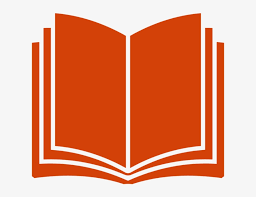

# Word Book - Google Chrome Extension

## Word Book is a google chrome extension that lets you search for meanings, synonyms, antonyms with examples of different words.

### :heavy_check_mark: Also get the pronounciation of the word.

### :heavy_check_mark: It's pretty convenient to use and learn words everyday to improve your vocabulary.

---

## :rocket: Technology Stack :

<table>
  <tbody>
    <tr valign="top">
      <td width="25%" align="center">
         <b>HTML</b>   
        
      </td>
         <td width="25%" align="center">
         <b>CSS</b>   
        
      </td>
      <td width="25%" align="center">
         <b>Javascript</b>   
        
      </td>
    </tr>
     </tbody>
</table>

 

